# Device Systems API

Mi API REST desarrollada con FastAPI y SQLAlchemy para la gestión del
recurso users, evolucionada en esta actividad GA1-220501096-01-AA1-EV09 –
FastAPI con SQLAlchemy: Persistencia de Datos y CRUD sobre Base de Datos en
device_systems.

## Descripción de la API

device_systems administra los usuarios mediante un CRUD completo crear,
leer, actualizar total y parcialmente, y eliminar, pero a diferencia de las
versiones anteriores, ahora los datos se guardan de forma continua en
una base de datos SQLite por medio del ORM SQLAlchemy — ya no se pierden al
apagar el servidor.

## Tecnologías utilizadas

- Python 3.14
- FastAPI 0.115+
- SQLAlchemy 2.0
- Pydantic v2
- SQLite
- Uvicorn
- uv (gestor de dependencias)

## Estructura del proyecto
device_systems/
├── app/
│ ├── main.py
│ ├── database/
│ │ └── connection.py
│ ├── models/
│ │ └── user_model.py
│ ├── schemas/
│ │ └── user_schema.py
│ ├── routes/
│ │ └── user_routes.py
│ ├── services/
│ │ └── user_service.py
│ └── dependencies/
│ ├── database_dependency.py
│ └── user_dependencies.py
├── device_systems.db (generado automáticamente, no se sube a Git)
├── pyproject.toml
└── README.md

- database/: configura el `engine`, la fábrica de sesiones (SessionLocal)
  y la clase base (Base) de la que heredan los modelos.
- models/: define las tablas reales de la base de datos con SQLAlchemy.
- schemas/: define cómo se validan y muestran los datos en la API (Pydantic).
- dependencies/: database_dependency.py entrega una sesión de base de
  datos a cada petición mediante `Depends()`.
- services/: contiene la lógica de negocio, ahora ejecutando consultas
  reales contra la base de datos (query,filter, commit, etc.).
- routes/: define los endpoints, delegando toda la lógica al service.

## Diferencia entre modelo SQLAlchemy y schema Pydantic

Aunque ambos representan a un "usuario", cumplen roles distintos:

| | Modelo SQLAlchemy (`user_model.py`) | Schema Pydantic (`user_schema.py`) |
|---|---|---|
| Propósito | Define la tabla en la base de datos | Define los datos que entran y salen de la API |
| Contiene | Columnas, tipos SQL, constraints (nullable, unique) | Tipos Python, validaciones (min_length, EmailStr) |
| Lo usa | SQLAlchemy, para leer/escribir en device_systems.db | FastAPI, para validar peticiones y formatear respuestas |

Se mantienen separados para que un cambio en la forma de la API no obligue a
modificar la estructura de la base de datos, y viceversa. El puente entre
ambos es la configuración from_attributes = True en UserResponse, que le
permite a Pydantic leer directamente los atributos de un objeto User de
SQLAlchemy.

## Instalación de dependencias

bash
uv sync

## Ejecución del servidor

bash
uv run uvicorn app.main:app --reload

Al iniciar por primera vez, se crea automáticamente el archivo
device_systems.db con la tabla users, gracias a
Base.metadata.create_all(bind=engine) en app/main.py.

Documentación interactiva:
- Swagger UI: http://127.0.0.1:8000/docs
- ReDoc: http://127.0.0.1:8000/redoc

## Tabla de endpoints

| Operación | Método | Ruta | Código esperado |
|---|---|---|---|
| Listar usuarios | GET | /users | 200 OK |
| Consultar usuario | GET | /users/{user_id} | 200 OK / 404 Not Found |
| Crear usuario | POST | /users | 201 Created / 400 / 422 |
| Actualizar completo | PUT | /users/{user_id} | 200 OK / 404 / 400 |
| Actualizar parcial | PATCH | /users/{user_id} | 200 OK / 400 (sin datos) / 404 |
| Eliminar usuario | DELETE | /users/{user_id} | 204 No Content / 404 |

## Modelo de la tabla `users`

| Campo | Tipo | Restricción |
|---|---|---|
| id | Integer | Primary Key |
| name | String | Obligatorio |
| email | String | Único y obligatorio |
| role | String | Obligatorio (`admin`, `support`, `user`) |
| is_active | Boolean | Por defecto `True` |
| created_at | DateTime | Se asigna automáticamente al crear |

## Cabeceras HTTP personalizadas

Todas las respuestas incluyen:

- X-App-Name: device_systems
- X-API-Version: 3.0

## Manejo de errores implementado

- 404 Not Found — usuario no encontrado (GET, PUT, PATCH, DELETE).
- 400 Bad Request — correo electrónico duplicado (POST, PUT, PATCH).
- 400 Bad Request — PATCH enviado sin ningún campo para actualizar.
- 422 Unprocessable Entity — datos inválidos según los esquemas Pydantic.

## Evidencia: estructura del proyecto

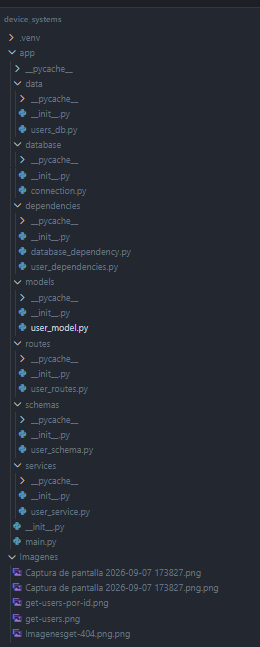

## Evidencia: base de datos generada

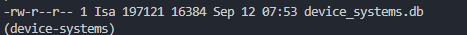

## Evidencia de pruebas por endpoint

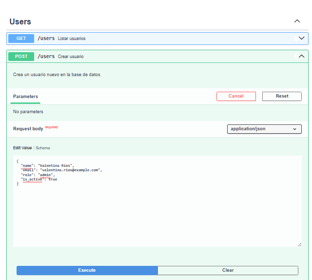

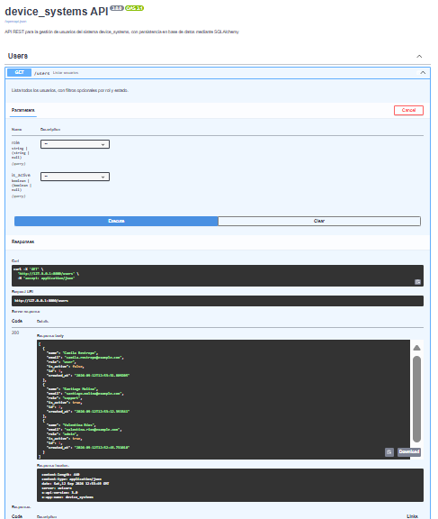

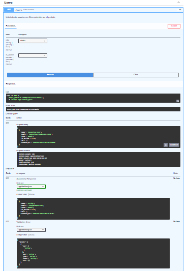

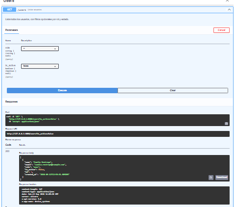

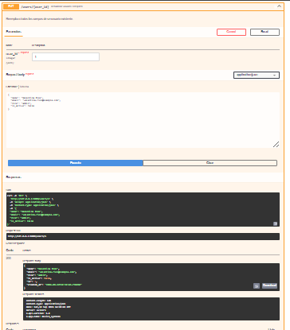

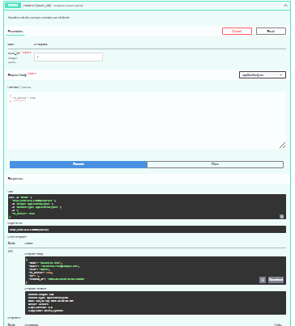

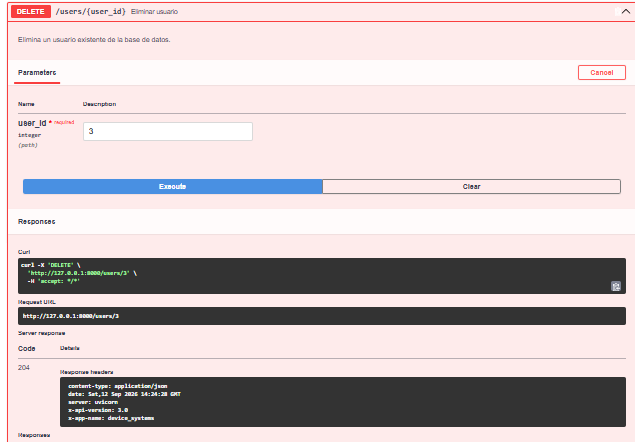

## Evidencia de errores controlados

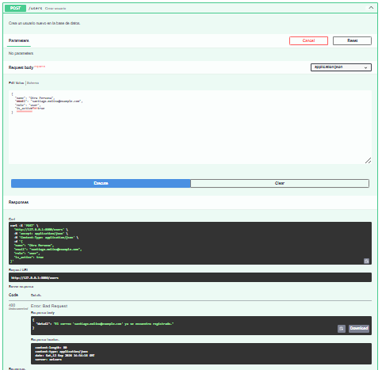

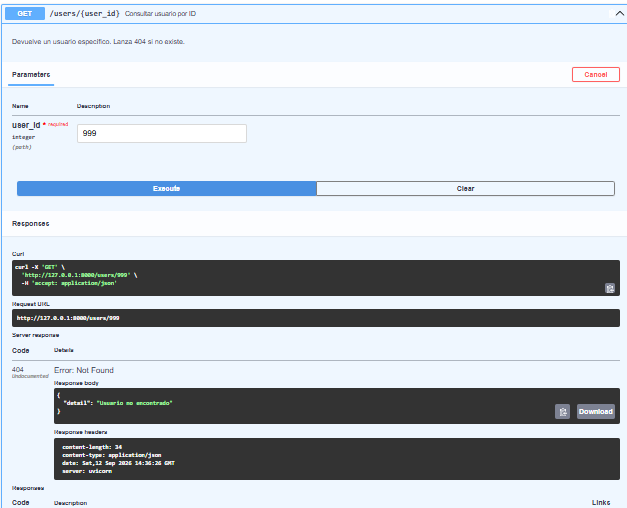

## Reflexión final sobre la importancia de la persistencia en una API

En esta actividad entendí cual es la diferencia real entre trabajar con datos en
memoria y trabajar con una base de datos persistente: antes, cada vez que
apagaba el servidor perdía todos los usuarios creados; ahora, gracias a
SQLAlchemy y SQLite, los datos permanecen guardados en el archivo
device_systems.db sin importar cuántas veces reinicie la aplicación.

tambien aprendí que un modelo SQLAlchemy y un schema Pydantic no son lo mismo,
aunque ambos representen a un "usuario": el modelo define cómo es la tabla
en la base de datos (con restricciones como nullable o unique), mientras
que el schema define cómo se validan y muestran los datos en la API. La
configuración from_attributes fue clave para conectar ambos mundos, ya que
le permite a Pydantic leer directamente los datos que vienen de un objeto
de SQLAlchemy.

También comprendí el concepto de ORM: en vez de escribir consultas SQL a
mano, puedo usar comandos de Python como db.query(User).filter(...) y
SQLAlchemy se encarga de traducirlos. Entender la diferencia entre add(),
commit() y refresh() me ayudó a ver que guardar en una base de datos no es
una sola acción, sino varios pasos: preparar el cambio, confirmarlo de
forma permanente, y luego sincronizar el objeto en Python con lo que
realmente quedó guardado.

Considero que la persistencia de datos es uno de los pilares de cualquier
API real: sin ella, una aplicación no podría recordar usuarios, pedidos,
mensajes ni ninguna información entre una sesión y otra. Esta actividad me
mostró el paso que separa un ejercicio de práctica de una aplicación que
realmente podría usarse en producción.
