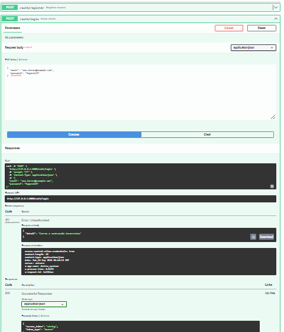
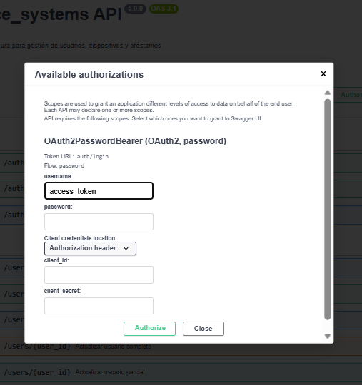
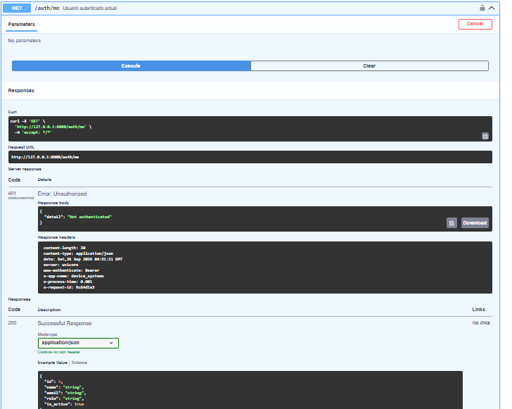
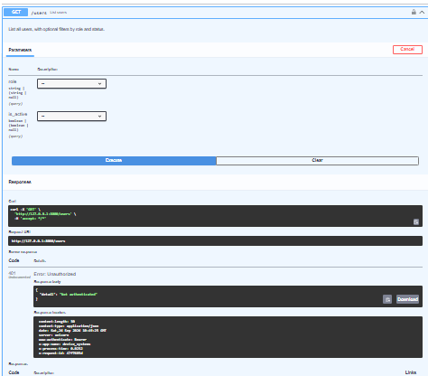

# Device Systems API

API REST desarrollada con FastAPI, SQLAlchemy, Alembic y ahora con una capa completa de seguridad (OAuth2, JWT, hash de contraseñas, CORS, middleware y rate limiting).

## Descripción general

device_systems gestiona usuarios, dispositivos y préstamos, con persistencia real en base de datos, relaciones entre modelos, migraciones versionadas y, desde esta actividad, autenticación y protección de rutas.

## Tecnologías utilizadas

- Python 3.14
- FastAPI
- SQLAlchemy 2.0
- Alembic
- Pydantic v2
- SQLite
- passlib (bcrypt)
- python-jose (JWT)
- slowapi (rate limiting)
- uv (gestor de dependencias)

## Instalación de dependencias

bash
uv sync

## Ejecución del servidor

bash
uv run uvicorn app.main:app --reload

Documentación interactiva:
- Swagger UI: http://127.0.0.1:8000/docs
- ReDoc: http://127.0.0.1:8000/redoc

## Estructura del proyecto
device_systems/
├── app/
│ ├── main.py
│ ├── auth/
│ │ ├── auth_routes.py
│ │ ├── auth_service.py
│ │ └── security.py
│ ├── database/connection.py
│ ├── models/ (user_model.py, device_model.py, loan_model.py)
│ ├── schemas/ (user_schema.py, device_schema.py, loan_schema.py, auth_schema.py)
│ ├── routes/ (user_routes.py, device_routes.py, loan_routes.py)
│ ├── services/ (user_service.py, device_service.py, loan_service.py)
│ ├── dependencies/ (database_dependency.py, auth_dependency.py)
│ └── middlewares/request_middleware.py
├── alembic/versions/
├── alembic.ini
├── requirements.txt
├── .env / .env.example
└── README.md

## Recurso nuevo: /auth

| Método | Ruta | Descripción |
|---|---|---|
| POST | /auth/register | Registra un usuario nuevo con contraseña segura (hash) |
| POST | /auth/login | Autentica y devuelve un token JWT |
| GET | /auth/me | Devuelve los datos del usuario autenticado actual |

## Autenticación y seguridad implementadas

- Hash de contraseñas con passlib (bcrypt)**: las contraseñas nunca se guardan en texto plano. Se almacenan como `hashed_password` en el modelo `User`.
- JWT (JSON Web Token): al hacer login exitoso, se genera un token firmado que el cliente debe enviar en la cabecera `Authorization: Bearer <token>` para acceder a rutas protegidas.
- Rutas protegidas: GET /users requiere un token válido (get_current_active_user). Sin token o con token inválido, responde 401 Unauthorized`.
- Roles y autorización: se implementaron dependencias require_admin y `require_admin_or_support` para restringir operaciones según el rol del usuario.
- Validaciones avanzadas con Pydantic v2: el schema UserRegister usa `field_validator` para exigir que la contraseña tenga mínimo 8 caracteres, al menos una mayúscula, una minúscula, un número y sin espacios.

## Middleware personalizado

Se implementó `RequestMiddleware`, que se ejecuta en todas las peticiones y agrega:

- X-App-Name: device_systems
- X-Process-Time: tiempo de respuesta de la petición, en segundos
- X-Request-ID: identificador único de la petición (generado o propagado si el cliente lo envía)

Además, registra en consola el método, la ruta y el código de estado de cada petición.

## CORS configurado

python
allow_origins=["http://localhost:5173", "http://localhost:3000"]
allow_credentials=True
allow_methods=["*"]
allow_headers=["*"]

### ¿Por qué no usar `allow_origins=["*"]` en producción con credenciales?

Cuando allow_credentials=True, el navegador exige que los orígenes permitidos estén listados explícitamente. Usar "*" (comodín) junto con credenciales expondría la API a que cualquier sitio web pueda enviar peticiones autenticadas en nombre del usuario (riesgo de CSRF o robo de sesión), ya que no habría control de qué dominios son realmente confiables. Por eso siempre se deben listar solo los dominios específicos y verificados del frontend real.

## Rate limiting

Se instaló y configuró slowapi para limitar peticiones abusivas, devolviendo 429 Too Many Requests cuando se supera el límite configurado en endpoints sensibles como `/auth/login` y `/auth/register`.

## Migración Alembic

Se generó una migración para agregar el campo hashed_password al modelo `User`:

bash
alembic revision --autogenerate -m "add authentication fields to users"
alembic upgrade head

## Capturas de evidencia

## Reflexión sobre la importancia de la seguridad en APIs REST

En esta actividad se puede ver que una API funcional no es suficiente si no está protegida. Aprendí que las contraseñas nunca deben guardarse en texto plano, y que el hash (con passlib/bcrypt) permite verificar una contraseña sin necesidad de almacenarla de forma reversible. JWT me permitió entender cómo un servidor puede "recordar" que un usuario inició sesión sin guardar estado en el servidor, ya que toda la información viaja firmada dentro del token. También comprendí la importancia del middleware para tener trazabilidad de cada petición, y por qué CORS y el rate limiting son defensas esenciales contra el mal uso de una API pública.