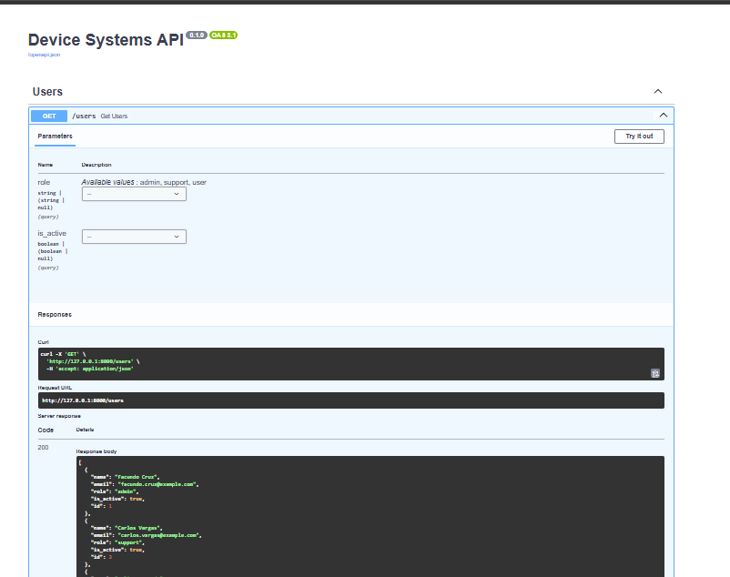
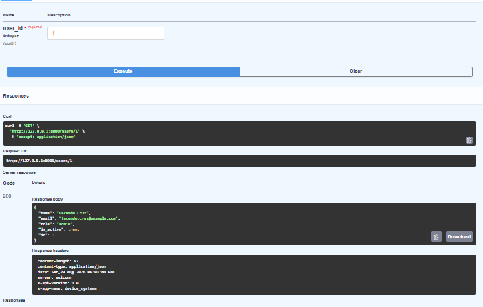
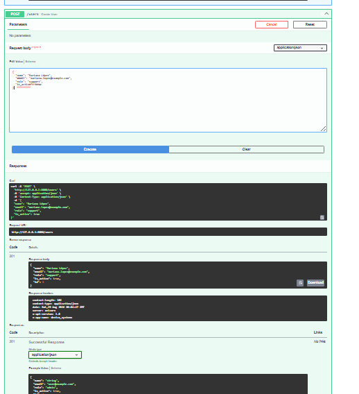
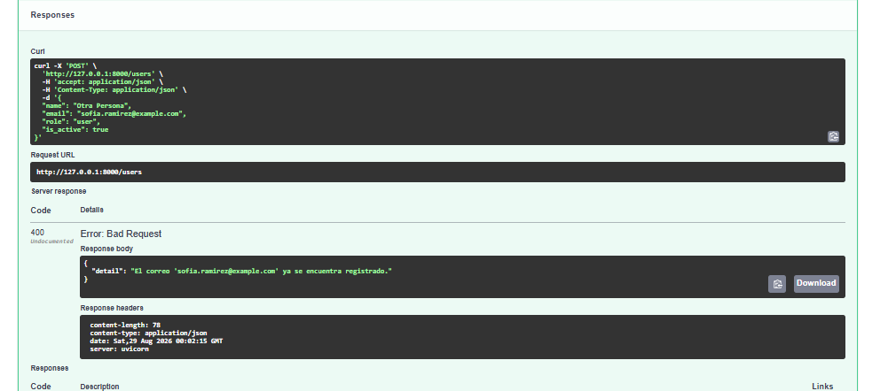
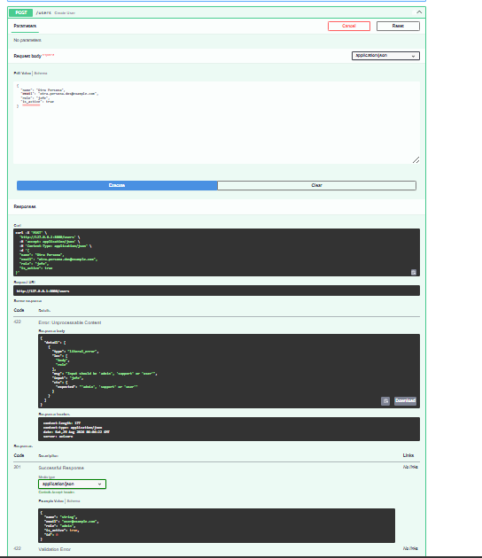

# Device Systems API

API REST desarrollada con **FastAPI** para la gestión del recurso `users`,
evolucionada en la actividad **AA1-EV08 – FastAPI Intermedio:
Evolución de device_systems con CRUD Completo, Manejo de Errores, Swagger/OpenAPI
y Dependency Injection**.

## Descripción de la API

device_systems` permite me administrar usuarios mediante un **CRUD completo**
(crear, leer, actualizar total y parcialmente, y eliminar), con validaciones
Pydantic v2, manejo profesional de errores mediante `HTTPException`, códigos
de estado HTTP correctos, documentación automática mejorada (Swagger/OpenAPI)
y reutilización de lógica mediante `Depends()`.

## Tecnologías utilizadas

- Python 3.14
- FastAPI 0.115+
- Pydantic v2
- Uvicorn
- uv (gestor de dependencias)

## Estructura del proyecto
device_systems/
├── app/
│ ├── main.py
│ ├── routes/
│ │ └── user_routes.py
│ ├── schemas/
│ │ └── user_schema.py
│ ├── services/
│ │ └── user_service.py
│ ├── dependencies/
│ │ └── user_dependencies.py
│ └── data/
│ └── users_db.py
├── pyproject.toml
└── README.md


- **routes/**: define los endpoints y delega la lógica al service.
- **schemas/**: modelos Pydantic de entrada (`UserCreate`, `UserUpdate`) y salida (`UserResponse`).
- **services/**: contiene la lógica de negocio (buscar, crear, actualizar, eliminar).
- **dependencies/**: funciones reutilizables inyectadas con `Depends()`.
- **data/**: simulación de base de datos en memoria (`users_db`).

## Instalación de dependencias

```bash
uv sync
```

## Ejecución del servidor

```bash
uv run uvicorn app.main:app --reload
```

Documentación interactiva:
- Swagger UI: http://127.0.0.1:8000/docs
- ReDoc: http://127.0.0.1:8000/redoc

## Tabla de endpoints

| Operación | Método | Ruta | Código esperado |
|---|---|---|---|
| Listar usuarios | GET | /users | 200 OK |
| Consultar usuario | GET | /users/{user_id} | 200 OK / 404 Not Found |
| Crear usuario | POST | /users | 201 Created / 400 / 422 |
| Actualizar completo | PUT | /users/{user_id} | 200 OK / 404 / 400 |
| Actualizar parcial | PATCH | /users/{user_id} | 200 OK / 400 (sin datos) / 404 |
| Eliminar usuario | DELETE | /users/{user_id} | 204 No Content / 404 |

## Cabeceras HTTP personalizadas

Todas las respuestas incluyen:

- X-App-Name: device_systems
- X-API-Version: 2.0

## Uso de Dependency Injection (Depends())

En app/dependencies/user_dependencies.py` se definieron funciones reutilizables:

- get_user_or_404(user_id)`: busca un usuario y lanza automáticamente un error
  404 si no existe, evitando repetir esa lógica en cada endpoint.
- verify_api_key(x_api_key)`: simula una validación de autenticación mediante
  una cabecera personalizada, usando `Header()` de FastAPI.

Estas funciones se inyectan en las rutas mediante el parámetro `Depends(),
permitiendo reutilizar lógica común sin duplicar código.

## Manejo de errores implementado

Se controla, mediante HTTPException, como mínimo:

- **404 Not Found** — usuario no encontrado (GET, PUT, PATCH, DELETE).
- **400 Bad Request** — correo electrónico duplicado (POST, PUT, PATCH).
- **400 Bad Request** — PATCH enviado sin ningún campo para actualizar.
- **422 Unprocessable Entity** — datos inválidos según los esquemas Pydantic
  (por ejemplo, un `role` fuera de `admin`, `support`, `user`).

Ejemplo de respuesta de error:

```json
{
  "detail": "Usuario no encontrado"
}
```

## Evidencia de pruebas — GET /users



## Evidencia de pruebas — GET /users/{user_id}



## Evidencia de pruebas — POST /users



## Evidencia de pruebas — PUT /users/{user_id}


## Evidencia de pruebas — PATCH /users/{user_id}


## Evidencia de pruebas — DELETE /users/{user_id}


## Evidencia de validaciones y errores

- **Correo duplicado (400):**



- **Rol inválido (422):**



- **PATCH vacío (400):**


- **Usuario inexistente (404):**


## Reflexión final sobre la evolución del proyecto

En esta actividad device_systems agrege el CRUD completo (PUT,
PATCH y DELETE), separando la lógica en carpetas services, dependencies y
data para mantener el código organizado. Aprendí a usar Depends()` para
reutilizar lógica común y a manejar errores de forma profesional con
HTTPException, controlando casos como usuarios inexistentes, correos
duplicados y actualizaciones sin datos. Swagger/OpenAPI facilitó muchísimo
probar cada endpoint sin necesidad de herramientas externas, mostrando en
tiempo real los códigos de estado y las respuestas de error.